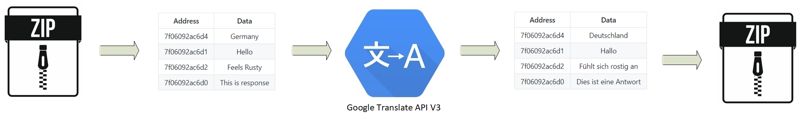

# Google DialogFlow Translate

#### *delightful google dialogflow agent tRanslation*

Command line tool for automated translation of Google DialogFlow agents

---

  <h3>
    <a href="https://github.com/jabber-tools/gdf_translate/blob/readme/README.md">
      User guide
    </a>
     | 
    <a href="https://github.com/jabber-tools/gdf_translate/blob/readme/README-devnotes.md">
      <i>Developer guide</i>
    </a>
     | 
    <a href="https://github.com/jabber-tools/gdf_translate/releases">
      Releases
    </a>
  </h3>

 

## How does it work?

First Google Dialogflow agent is exported into ZIP file and this file is provided to translation utility. Translation utility parses the file and deserialises its content into internal structures stored in memory. 
 

In fact structures themselves are stored on stack whereas its content is stored on heap. Each entry on heap has its address (referred from stack) and data/content (e.g. string that needs to be translated!) 
 

Translation utility traverses all structures created in deserialization step and creates table to be translated. This table (hashmap) has original heap address as a key and data/content as a value. 

| Address      |      Data      |
|--------------|:--------------:|
| 7f06092ac6d4 |  Germany       |
| 7f06092ac6d1 |    Hello       |
| 7f06092ac6d2 | Feels Rusty    |
|7f06092ac6d0  |This is response|

Table (i.e. data column) is translated. Two approaches are used:
<ul>
  <li>Google V2 translation API
    <ul>
      <li>Each row is translated as separate HTTP transaction. We are running translation in parallel (4-10 translations executed at the same time) but still this approach is slow and error prone. TYpical agent can have thousands of translation to be executed. Running such a huge number of HTTP transactions will face the networking issues and possibly also Google API quotas issues (i.e. rate limiting by API due to too many concurrent invocations).</li>
    </ul>
  </li>
  <li>Google V3 translation API
    <ul>
      <li>Hashmap is converted to CSV file</li>
      <li>CSV file is uploaded into Google Cloud Storage Bucket</li>
      <li>Batch translation is started</li>
      <li>Batch translation status is checked regularly up to the point where result is produced again as CSV file in Google Cloud Storage Bucket</li>
      <li>Output Google Cloud Storage Bucket content is downloaded and transformed from CVS file into hashmap again. Something like: 
                <table>
                  <tbody>
                    <tr>
                      <th align="center">Address</th>
                      <th align="center">Data</th>
                    </tr>
                    <tr>
                      <td>7f06092ac6d4</td>
                      <td align="center">Deutschland</td>
                    </tr>
                    <tr>
                      <td>7f06092ac6d1</td>
                      <td align="center">Hallo</td>
                    </tr>
                    <tr>
                      <td>7f06092ac6d2</td>
                      <td align="center">Fühlt sich rostig an</td>
                    </tr>
                    <tr>
                      <td>7f06092ac6d0</td>
                      <td align="center">Dies ist eine Antwort</td>
                    </tr>
                  </tbody>
                </table>        
      </li>
      <li>Agent structure is traversed again (same as when creating original translation table/hashmap). For every address we are doing lookup (by address) into translated hashmap and replacing the value accordingly</li>
      <li>Agent is then serialized and packed into ZIP file.</li>
      <li>So in a nutshell:
        
      </li>
    </ul>
  </li>
</ul>
 
## Serialization/deserialization process
For deserialization of zip file and subsequent serialization of translated agent back into zip file we are using [Serde](https://serde.rs/) framework. Google DialogFlow ZIP file consists of may different JSON files. These files are all mapped into corresponding Rust [structures](https://doc.rust-lang.org/book/ch05-00-structs.html). There is always risk underlying format of ZIP file might change and we will not be able to serialize or deserialize the data correctly. Especially it might happen that zip file structures will be extended and corresponding rust structures will not contain new attributes. This would result in loss of new attributes in serialized agent! To detect such a situation we are doing following sanity check: 
* every file is deserialized and then (without any change) serialized back to JSON. 
* JSON’s (original JSON and new one after serialization) are <b>structurally</b> compared. 
* If they are not equal, exception is raised and translation process is aborted. Code then needs to be extended accordingly so that it matches to latest zip file structure. 

## How to enable debug logging?
In case of troubleshooting it might be handy to enable debug log messages. This can be done by setting following environment variables:

* set RUST_LOG=gdf_translate::main=debug
* set RUST_LOG=gdf_translate::google::gcloud::translate=debug
* set RUST_LOG=gdf_translate::google::gcloud::translate::v2=debug
* set RUST_LOG=gdf_translate::google::gcloud::translate::v3=debug
* set RUST_LOG=gdf_translate::google::gcloud::storage_bucket_mgmt.rs=debug
* set RUST_LOG=gdf_translate::google::dialogflow::agent=debug

Also it might be handy to enable stacktrace printing via followin environment variable: <i>set RUST_BACKTRACE = 1</i>

